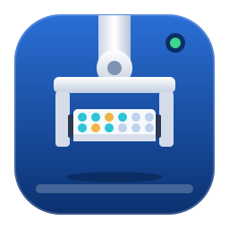
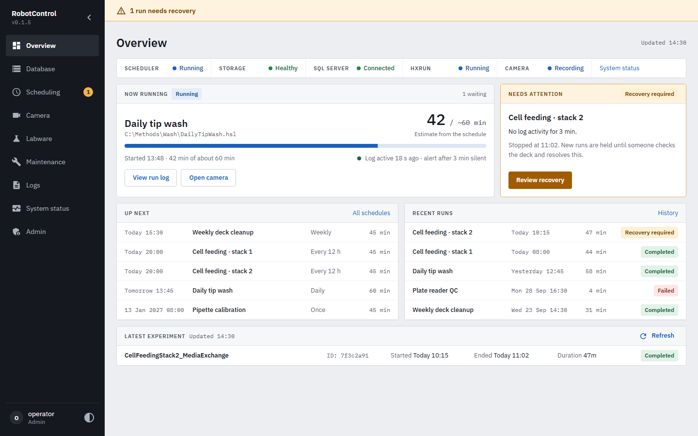

<p align="center">
  
</p>

<h1 align="center">RobotControl</h1>

<p align="center">
  <a href="LICENSE"></a>
  
  
  
  
</p>

RobotControl is a browser-based control panel for the Hamilton liquid-handling robot in the
Shou Group at UCL. It runs on the Windows PC next to the robot and brings scheduling, the deck
camera, labware tracking and the Hamilton database into one place, on that PC or remotely
through a Cloudflare Tunnel.



## What it does

- **Scheduling.** Recurring and one-off runs of Hamilton methods (started through HxRun), with
  a calendar, run history and archived schedules. After a run fails or its log goes quiet, new
  runs are held until someone has checked the deck and marked it recovered.
- **Camera.** Live view in the browser (H.264), one-minute rolling recordings, and an archive
  of the footage around each experiment.
- **Labware.** Tip tracking for every tip rack, and plate assignments for the Cytomat.
- **Database.** Browse tables and stored procedures, back up and restore the Hamilton SQL Server
  database, and run installable Python database packages (reports, data retrieval, preparation
  steps). See [database_packages/README.md](database_packages/README.md).
- **Logs and maintenance.** RobotControl logs, Hamilton traces, and HxRun maintenance mode.
- **System status.** CPU (with RobotControl's own share), memory, disk, database connections and
  live-view sessions.
- **Accounts.** Local users with admin and user roles. Risky actions, such as uploads and some
  database operations, only work from a browser on the robot PC itself.

## Requirements

- 64-bit Windows 10 or 11 on the robot PC.
- Hamilton VENUS with HxRun and its SQL Server instance, for scheduling and the database pages.
- [Microsoft ODBC Driver for SQL Server](https://learn.microsoft.com/en-us/sql/connect/odbc/download-odbc-driver-for-sql-server)
  (18 or 17; RobotControl picks the newest one installed).
- A USB camera, if you want live view and recordings.
- For live view: Chrome or Edge 94+, Safari 16.4+ or Firefox 130+, opened on `localhost` or an
  `https://` address.

RobotControl still starts without SQL Server, Hamilton software or a camera. The affected pages
then report what is missing, and local sign-in keeps working.

## Installing

RobotControl ships as a folder containing `RobotControl.exe`, `_internal`, `ffmpeg.exe`,
the starter database packages and the licence notices. Older pre-release builds are on the
[Releases page](https://github.com/MxBlackSheep/RobotControl/releases); to get the current
code, build it yourself (see [Building the Windows package](#building-the-windows-package)).

1. Install the ODBC driver on the robot PC.
2. Copy the whole `RobotControl` folder to the robot PC. `RobotControl.exe` does not run
   without the rest of the folder.
3. Start `RobotControl.exe`. It serves the app on port 8005 and opens
   <http://localhost:8005> in your browser.
4. Sign in as `admin` on the robot PC. To choose this account's password before the first
   start, set the `ROBOTCONTROL_ADMIN_PASSWORD` environment variable. Otherwise the app uses a
   built-in default and asks you to change it when you sign in. Remote sign-in with the
   built-in default is refused, so do this before you use remote access.

To update, replace everything in the folder except `data`.

### Where things are kept

Everything RobotControl writes goes into the `data` folder next to `RobotControl.exe`.

| Path | Contents |
| --- | --- |
| `data/logs/` | Backend logs (`robotcontrol_backend.log`), rotated automatically |
| `data/videos/rolling_clips/` | The last 120 one-minute camera clips, stored as MP4 |
| `data/videos/experiments/` | Footage archived around each finished experiment |
| `data/backups/` | SQL Server database backups |
| `data/config/` | Camera selection and other runtime settings |
| `data/robotcontrol_scheduling.db` | Schedules and run history. Deleting it resets the scheduler. |
| `data/robotcontrol_auth.db` | User accounts |

### Remote access

Other PCs and phones reach RobotControl through a Cloudflare Tunnel that serves it over
HTTPS. Setup, and what remote users can and cannot do, are described in the
[remote access guide](docs/maintenance/backend/remote-access-guide.md).

## Development

You need [uv](https://docs.astral.sh/uv/getting-started/installation/) and
[Node.js 24 LTS](https://nodejs.org/en/download). Open a new PowerShell window after
installing them, then run these from the repository root:

```powershell
uv sync --locked
npm --prefix frontend ci
npm --prefix frontend run build
uv run --locked python build_scripts/fetch_ffmpeg.py
```

uv installs the Python version pinned in `.python-version` (3.14) into `.venv`; you don't
need a separate Python install. The last command downloads the pinned LGPL build of
`ffmpeg.exe` into `build/vendor`, which live view and clip storage use. It is checked against
its SHA-256 and is not committed.

Start the backend, which also serves the built frontend:

```powershell
uv run --locked python backend/main.py --host 127.0.0.1 --port 8005 --no-browser
```

Then open <http://127.0.0.1:8005>. For frontend work with hot reload, run
`npm --prefix frontend run dev` in a second window and use port 3005; API calls are proxied to
8005.

To keep a development copy from starting scheduled runs or recordings, set these before
starting it (they work for the packaged app too):

```powershell
$env:ROBOTCONTROL_SCHEDULER_AUTOSTART_DELAY_SECONDS = "disable"
$env:ROBOTCONTROL_AUTO_RECORDING_ENABLED = "0"
```

### Tests

```powershell
uv run --locked python -m pytest backend/tests
npm --prefix frontend run type-check
```

Browser checks use Playwright against a faked backend and need a current frontend build. How
to run them, and which spec covers which page, is in
[frontend/e2e/README.md](frontend/e2e/README.md). Checks that reach real SQL Server, ffmpeg or
packaging live in `backend/e2e`; each file's header says what it covers and how to run it.

### Dependencies

Python dependencies are declared in `pyproject.toml` and locked in `uv.lock`; commit both. Use
`uv add`, `uv remove` or `uv lock --upgrade-package <name>`. Passlib 1.7.4 and bcrypt 4.3.0 are
pinned together on purpose: newer bcrypt breaks Passlib, and changing either needs a password
migration.

### Building the Windows package

```powershell
npm --prefix frontend run build
uv run --locked python build_scripts/embed_resources.py
uv run --locked --group build python build_scripts/pyinstaller_build.py --output-dir dist/<name>
```

The package ends up in `dist/<name>/RobotControl`, with the app icon and `ffmpeg.exe`
included. Add `--console` to see diagnostic output in a console window. Before handing a build
over, run the packaged smoke test and walkthrough described in
[frontend/e2e/README.md](frontend/e2e/README.md).

## Repository layout

| Folder | Contents |
| --- | --- |
| `backend/` | FastAPI app (API routes, services), pytest tests and `e2e` checks |
| `frontend/` | React, TypeScript and MUI client, with Playwright checks in `e2e` |
| `database_packages/` | Installable database tools and reports, with their authoring guide |
| `build_scripts/` | Resource embedding, PyInstaller build, ffmpeg fetch, app icon |
| `docs/` | Maintenance guides per module, change history and dated reviews ([map](docs/README.md)) |

## Contributing

Changes go through pull requests into `main`; branch naming, commit messages and release
tags are in [CONTRIBUTING.md](CONTRIBUTING.md).

## License

RobotControl is released under the [MIT License](LICENSE).

The Windows package also bundles third-party software under its own licences. `ffmpeg.exe`
is a separate LGPL 3.0 build of FFmpeg with OpenH264; their licence texts are in the
package's `THIRD_PARTY_NOTICES` folder. The Python and JavaScript libraries keep their own
licences. Hamilton, VENUS and HxRun are products of Hamilton Company; RobotControl is not
affiliated with or endorsed by Hamilton.

## Contact

Maintained by Andy Sun (sunfangziyue@gmail.com, zcbtunx@ucl.ac.uk). Please report problems
through [GitHub Issues](https://github.com/MxBlackSheep/RobotControl/issues).
